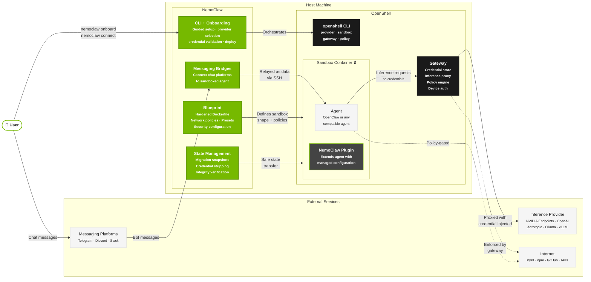

# NVIDIA NemoClaw: Reference Stack for Running OpenClaw in OpenShell

<!-- start-badges -->
[](https://github.com/NVIDIA/NemoClaw/blob/main/LICENSE)
[](https://github.com/NVIDIA/NemoClaw/blob/main/SECURITY.md)
[](https://github.com/NVIDIA/NemoClaw/blob/main/docs/about/release-notes.md)
<!-- end-badges -->

<!-- start-intro -->
NVIDIA NemoClaw is an open source reference stack that simplifies running [OpenClaw](https://openclaw.ai) always-on assistants more safely.
It installs the [NVIDIA OpenShell](https://github.com/NVIDIA/OpenShell) runtime, part of NVIDIA Agent Toolkit, which provides additional security for running autonomous agents.
It also includes open source models such as [NVIDIA Nemotron](https://build.nvidia.com).
<!-- end-intro -->

> **Alpha software**
>
> NemoClaw is available in early preview starting March 16, 2026.
> This software is not production-ready.
> Interfaces, APIs, and behavior may change without notice as we iterate on the design.
> The project is shared to gather feedback and enable early experimentation.
> We welcome issues and discussion from the community while the project evolves.

---

## Architecture

**OpenShell** is a general-purpose agent runtime. It provides sandbox containers, a credential-storing gateway, inference proxying, and policy enforcement — but no opinions about what runs inside.

**NemoClaw** is an opinionated reference stack built on OpenShell. It adds:

| Layer | What it provides |
|-------|------------------|
| **Onboarding** | Guided setup that validates credentials, selects providers, and creates a working sandbox in one command. |
| **Blueprint** | A hardened Dockerfile with security policies, capability drops, and least-privilege network rules. |
| **State management** | Safe migration of agent state across machines with credential stripping and integrity verification. |
| **Messaging bridges** | Host-side processes that connect Telegram, Discord, and Slack to the sandboxed agent. |

OpenShell handles *how* to sandbox an agent securely. NemoClaw handles *what* goes in the sandbox and makes the setup accessible.



---

## Quick Start

Follow these steps to get started with NemoClaw and your first sandboxed OpenClaw agent.

> **ℹ️ Note**
>
> NemoClaw creates a fresh OpenClaw instance inside the sandbox during onboarding.

<!-- start-quickstart-guide -->

### Prerequisites

Check the prerequisites before you start to ensure you have the necessary software and hardware to run NemoClaw.

#### Hardware

| Resource | Minimum        | Recommended      |
|----------|----------------|------------------|
| CPU      | 4 vCPU         | 4+ vCPU          |
| RAM      | 8 GB           | 16 GB            |
| Disk     | 20 GB free     | 40 GB free       |

The sandbox image is approximately 2.4 GB compressed. During image push, the Docker daemon, k3s, and the OpenShell gateway run alongside the export pipeline, which buffers decompressed layers in memory. On machines with less than 8 GB of RAM, this combined usage can trigger the OOM killer. If you cannot add memory, configuring at least 8 GB of swap can work around the issue at the cost of slower performance.

#### Software

| Dependency | Version                          |
|------------|----------------------------------|
| Linux      | Ubuntu 22.04 LTS or later |
| Node.js    | 22.16 or later |
| npm        | 10 or later |
| Container runtime | Supported runtime installed and running |
| [OpenShell](https://github.com/NVIDIA/OpenShell) | Installed |

#### Container Runtime Support

| Platform | Supported runtimes | Notes |
|----------|--------------------|-------|
| Linux | Docker | Primary supported path today |
| macOS (Apple Silicon) | Colima, Docker Desktop | Recommended runtimes for supported macOS setups |
| macOS | Podman | Not supported yet. NemoClaw currently depends on OpenShell support for Podman on macOS. |
| Windows WSL | Docker Desktop (WSL backend) | Supported target path |

#### macOS first-run checklist

On a fresh macOS machine, install the prerequisites in this order:

1. Install Xcode Command Line Tools:

   ```bash
   xcode-select --install
   ```

2. Install and start a supported container runtime:
   - Docker Desktop
   - Colima
3. Run the NemoClaw installer.

This avoids the two most common first-run failures on macOS:

- missing developer tools needed by the installer and Node.js toolchain
- Docker connection errors when no supported container runtime is installed or running

> **💡 Tip**
>
> For DGX Spark, follow the [DGX Spark setup guide](https://github.com/NVIDIA/NemoClaw/blob/main/spark-install.md). It covers Spark-specific prerequisites, such as cgroup v2 and Docker configuration, before running the standard installer.

### Install NemoClaw and Onboard OpenClaw Agent

Download and run the installer script.
The script installs Node.js if it is not already present, then runs the guided onboard wizard to create a sandbox, configure inference, and apply security policies.

```bash
curl -fsSL https://www.nvidia.com/nemoclaw.sh | bash
```

If you use nvm or fnm to manage Node.js, the installer may not update your current shell's PATH.
If `nemoclaw` is not found after install, run `source ~/.bashrc` (or `source ~/.zshrc` for zsh) or open a new terminal.

When the install completes, a summary confirms the running environment:

```text
──────────────────────────────────────────────────
Sandbox      my-assistant (Landlock + seccomp + netns)
Model        nvidia/nemotron-3-super-120b-a12b (NVIDIA Endpoints)
──────────────────────────────────────────────────
Run:         nemoclaw my-assistant connect
Status:      nemoclaw my-assistant status
Logs:        nemoclaw my-assistant logs --follow
──────────────────────────────────────────────────

[INFO]  === Installation complete ===
```

### Chat with the Agent

Connect to the sandbox, then chat with the agent through the TUI or the CLI.

#### Connect to the Sandbox

Run the following command to connect to the sandbox:

```bash
nemoclaw my-assistant connect
```

This connects you to the sandbox shell `sandbox@my-assistant:~$` where you can run `openclaw` commands.

#### OpenClaw TUI

In the sandbox shell, run the following command to open the OpenClaw TUI, which opens an interactive chat interface.

```bash
openclaw tui
```

Send a test message to the agent and verify you receive a response.

> **ℹ️ Note**
>
> The TUI is best for interactive back-and-forth. If you need the full text of a long response such as a large code generation output, use the CLI instead.

#### OpenClaw CLI

In the sandbox shell, run the following command to send a single message and print the response:

```bash
openclaw agent --agent main --local -m "hello" --session-id test
```

This prints the complete response directly in the terminal and avoids relying on the TUI view for long output.

### Uninstall

To remove NemoClaw and all resources created during setup, in the terminal outside the sandbox, run:

```bash
curl -fsSL https://raw.githubusercontent.com/NVIDIA/NemoClaw/refs/heads/main/uninstall.sh | bash
```

The script removes sandboxes, the NemoClaw gateway and providers, related Docker images and containers, local state directories, and the global `nemoclaw` npm package. It does not remove shared system tooling such as Docker, Node.js, npm, or Ollama.

| Flag               | Effect                                              |
|--------------------|-----------------------------------------------------|
| `--yes`            | Skip the confirmation prompt.                       |
| `--keep-openshell` | Leave the `openshell` binary installed.              |
| `--delete-models`  | Also remove NemoClaw-pulled Ollama models.           |

For example, to skip the confirmation prompt:

```bash
curl -fsSL https://raw.githubusercontent.com/NVIDIA/NemoClaw/refs/heads/main/uninstall.sh | bash -s -- --yes
```

<!-- end-quickstart-guide -->

---

## How It Works

NemoClaw installs the NVIDIA OpenShell runtime, then creates a sandboxed OpenClaw environment where every network request, file access, and inference call is governed by declarative policy. The `nemoclaw` CLI orchestrates the full stack: OpenShell gateway, sandbox, inference provider, and network policy.

| Component        | Role                                                                                      |
|------------------|-------------------------------------------------------------------------------------------|
| **Plugin**       | TypeScript CLI commands for launch, connect, status, and logs.                            |
| **Blueprint**    | Versioned Python artifact that orchestrates sandbox creation, policy, and inference setup. |
| **Sandbox**      | Isolated OpenShell container running OpenClaw with policy-enforced egress and filesystem.  |
| **Inference**    | Provider-routed model calls, routed through the OpenShell gateway, transparent to the agent. |

The blueprint lifecycle follows four stages: resolve the artifact, verify its digest, plan the resources, and apply through the OpenShell CLI.

When something goes wrong, errors may originate from either NemoClaw or the OpenShell layer underneath. Run `nemoclaw <name> status` for NemoClaw-level health and `openshell sandbox list` to check the underlying sandbox state.

---

## Inference

Inference requests from the agent never leave the sandbox directly. OpenShell intercepts every call and routes it to the provider you selected during onboarding.

Supported non-experimental onboarding paths:

| Provider | Notes |
|---|---|
| NVIDIA Endpoints | Curated hosted models on `integrate.api.nvidia.com`. |
| OpenAI | Curated GPT models plus `Other...` for manual model entry. |
| Other OpenAI-compatible endpoint | For proxies and compatible gateways. |
| Anthropic | Curated Claude models plus `Other...` for manual model entry. |
| Other Anthropic-compatible endpoint | For Claude proxies and compatible gateways. |
| Google Gemini | Google's OpenAI-compatible endpoint. |

During onboarding, NemoClaw validates the selected provider and model before it creates the sandbox:

- OpenAI-compatible providers: tries `/responses` first, then `/chat/completions`
- Anthropic-compatible providers: tries `/v1/messages`
- If validation fails, the wizard prompts you to fix the selection before continuing

Credentials stay on the host in `~/.nemoclaw/credentials.json`. The sandbox only sees the routed `inference.local` endpoint, not your raw provider key.

Local Ollama is supported in the standard onboarding flow. Local vLLM remains experimental, and local host-routed inference on macOS still depends on OpenShell host-routing support in addition to the local service itself being reachable on the host.

## Host-Side State and Config

NemoClaw keeps its operator-facing state on the host rather than inside the sandbox.
These are the main files new users usually need to locate:

| Path | Purpose |
|---|---|
| `~/.nemoclaw/credentials.json` | Provider credentials saved during onboarding |
| `~/.nemoclaw/sandboxes.json` | Registered sandbox metadata, including the default sandbox selection |
| `~/.openclaw/openclaw.json` | Host OpenClaw configuration that NemoClaw snapshots or restores during migration flows |

Common environment variables for optional services and local access include `TELEGRAM_BOT_TOKEN`, `ALLOWED_CHAT_IDS`, and `CHAT_UI_URL`.
For normal sandbox setup and reconfiguration, prefer `nemoclaw onboard` over editing these files by hand.

---

## Protection Layers

The sandbox starts with a default policy that controls network egress and filesystem access:

| Layer      | What it protects                                    | When it applies             |
|------------|-----------------------------------------------------|-----------------------------|
| Network    | Blocks unauthorized outbound connections.           | Hot-reloadable at runtime.  |
| Filesystem | Prevents reads/writes outside `/sandbox` and `/tmp`.| Locked at sandbox creation. |
| Process    | Blocks privilege escalation and dangerous syscalls. | Locked at sandbox creation. |
| Inference  | Reroutes model API calls to controlled backends.    | Hot-reloadable at runtime.  |

When the agent tries to reach an unlisted host, OpenShell blocks the request and surfaces it in the TUI for operator approval.

---

## Configuring Sandbox Policy

The sandbox policy is defined in a declarative YAML file and enforced by the OpenShell runtime.
NemoClaw ships a default policy in [`nemoclaw-blueprint/policies/openclaw-sandbox.yaml`](https://github.com/NVIDIA/NemoClaw/blob/main/nemoclaw-blueprint/policies/openclaw-sandbox.yaml) that denies all network egress except explicitly listed endpoints.

Operators can customize the policy in two ways:

| Method | How | Scope |
|--------|-----|-------|
| **Static** | Edit `openclaw-sandbox.yaml` and re-run `nemoclaw onboard`. | Persists across restarts. |
| **Dynamic** | Run `openshell policy set <policy-file>` on a running sandbox. | Session only; resets on restart. |

NemoClaw includes preset policy files for common integrations such as PyPI, Docker Hub, Slack, and Jira in `nemoclaw-blueprint/policies/presets/`. Apply a preset as-is or use it as a starting template.

NemoClaw is an open project — we are still determining which presets to ship by default. If you have suggestions, please open an [issue](https://github.com/NVIDIA/NemoClaw/issues) or [discussion](https://github.com/NVIDIA/NemoClaw/discussions).

When the agent attempts to reach an endpoint not covered by the policy, OpenShell blocks the request and surfaces it in the TUI (`openshell term`) for the operator to approve or deny in real time. Approved endpoints persist for the current session only.

For step-by-step instructions, see [Customize Network Policy](https://docs.nvidia.com/nemoclaw/latest/network-policy/customize-network-policy.html). For the underlying enforcement details, see the OpenShell [Policy Schema](https://docs.nvidia.com/openshell/latest/reference/policy-schema.html) and [Sandbox Policies](https://docs.nvidia.com/openshell/latest/sandboxes/policies.html) documentation.

---

## Key Commands

### Host commands (`nemoclaw`)

Run these on the host to set up, connect to, and manage sandboxes.

| Command                              | Description                                            |
|--------------------------------------|--------------------------------------------------------|
| `nemoclaw onboard`                  | Interactive setup wizard: gateway, providers, sandbox. |
| `nemoclaw <name> connect`            | Open an interactive shell inside the sandbox.          |
| `openshell term`                     | Launch the OpenShell TUI for monitoring and approvals. |
| `nemoclaw start` / `stop` / `status` | Manage auxiliary services (Telegram bridge, tunnel).   |

See the full [CLI reference](https://docs.nvidia.com/nemoclaw/latest/reference/commands.html) for all commands, flags, and options.

---

## Learn More

Refer to the documentation for more information on NemoClaw.

- [Overview](https://docs.nvidia.com/nemoclaw/latest/about/overview.html): Learn what NemoClaw does and how it fits together.
- [How It Works](https://docs.nvidia.com/nemoclaw/latest/about/how-it-works.html): Learn about the plugin, blueprint, and sandbox lifecycle.
- [Architecture](https://docs.nvidia.com/nemoclaw/latest/reference/architecture.html): Learn about the plugin structure, blueprint lifecycle, and sandbox environment.
- [Inference Profiles](https://docs.nvidia.com/nemoclaw/latest/reference/inference-profiles.html): Learn how NemoClaw configures routed inference providers.
- [Network Policies](https://docs.nvidia.com/nemoclaw/latest/reference/network-policies.html): Learn about egress control and policy customization.
- [CLI Commands](https://docs.nvidia.com/nemoclaw/latest/reference/commands.html): Learn about the full command reference.
- [Troubleshooting](https://docs.nvidia.com/nemoclaw/latest/reference/troubleshooting.html): Troubleshoot common issues and resolution steps.
- [Discord](https://discord.gg/XFpfPv9Uvx): Join the community for questions and discussion.

## License

This project is licensed under the [Apache License 2.0](LICENSE).
